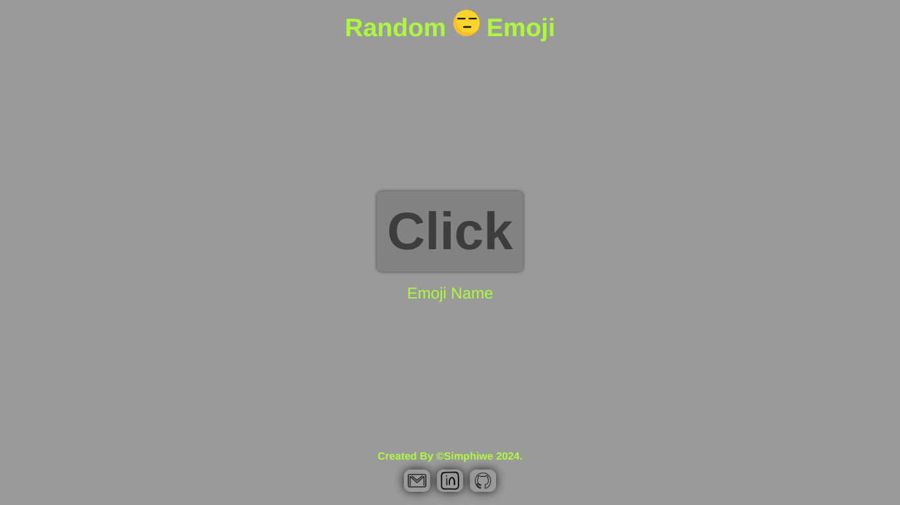

# Random Emoji

Check it _**LIVE**_ 👉
**<https://deebest.github.io/random-emoji/>**

A web application that gets emojis from an api and display each when you click on the button

## Uses

- Look up for your favorite emojis and find out their names.

## Tech Stack Used

- GIT
- HTML
- CSS
- JavaScript

## Get In Touch 👇

Email : **<simphiwedladla8@gmail.com>**

Linked: **<https://www.linkedin.com/in/dladla-simphiwe-89061a20a/>**

Github: **<https://github.com/DeeBest>**

Portfolio: **<https://deebest.github.io/personal-webpage/>**

## Credits

Emojis are from <a href="https://emoji-api.com/"> **Open Emoji API**.
